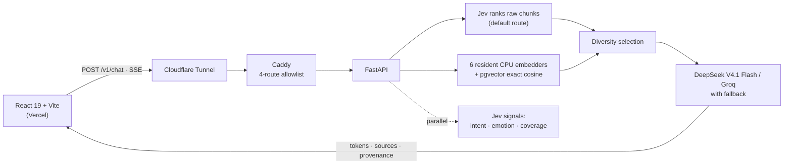

# RAG Playground

The question-answering system behind [yash456k.com](https://www.yash456k.com/#playground). Visitors choose a retrieval route and a model, get a streamed, cited answer, and can inspect which chunks it used, how they scored, and how long each stage took.

[](https://www.yash456k.com/#playground)
[](Dockerfile)
[](frontend/)
[](app/)
[](sql/schema.sql)
[](https://github.com/Yash456k/rag-playground/actions/workflows/ci.yml)
[](LICENSE)

[](https://www.yash456k.com/#playground)

## Highlights

- **Embedding-free retrieval that beats the embedders.** The default route sends every chunk's text to TypeSafe's Jev decision model, which picks the best chunk and ranks the rest. On 39 answerable evaluation questions its first pick was always correct evidence (MRR 1.000 vs 0.908 for the best of six embedding models; Recall@1 0.949 vs 0.808). Its "none of these" probability refuses unanswerable questions before any LLM call: every answerable case scored at least 0.95, every refusal case at most 0.07. [Report](evaluation/jev-retrieval.md)
- **Chunking decided by measurement.** Hand-reviewed semantic chunks beat the automatic splitter by +0.10 Recall@5 on a challenge set frozen before the first run, with 16 evidence gains and no losses across six embedding routes. [Report](docs/manual-semantic-chunking-evaluation.md)
- **Model chosen by test.** Eight generation models answered the same 46 evaluation questions from identical retrieval. DeepSeek V4.1 Flash scored best (80–87%) with the fastest first token (1.5 s) at $0.00025 per answer. [Report](evaluation/llm-comparison.md)
- **Every answer is inspectable.** Retrieved chunks and scores, requested and served model, fallback attempts, and stage latency stream beside the answer. A parallel Jev request reads each visitor message's intent, emotion, and whether the portfolio covers it.

## How it works



1. Validate the question, history, route, model, and depth, then reserve per-IP, daily, and monthly-budget quota atomically in PostgreSQL.
2. Build a history-aware retrieval query from recent user turns only; assistant output is never treated as evidence.
3. Rank chunks with Jev, or embed the query and scan the matching pgvector column. Jev's "none" or a low embedding score answers locally without a model call; greetings get a welcome instead of a refusal.
4. Format only the selected excerpts into an untrusted-data prompt and stream tokens, citations, usage, and stage latency.
5. Record the question, answer, retrieval details, and signals for grading.

Seven retrieval routes: Jev plus six embedders (MiniLM L6, BGE Small, BGE Base, Qwen3 Embedding 0.6B, and two small models fine-tuned on reviewed portfolio questions). Evaluation and production share the query builder, candidate depth, selector, and prompt formatter, so measured results describe the live system.

## Evaluation

46 cases across `dev`, `heldout`, and `challenge-v2`: recruiter and interviewer questions, follow-ups, typos, unsupported requests, and prompt injection. Each has evidence qrels and an answer contract (required facts, forbidden claims, citation rules, refusal expectations). `heldout` and `challenge-v2` are checksum-locked; `challenge-v2` was written after the chunks were frozen. See [evaluation/README.md](evaluation/README.md).

```bash
python -m scripts.evaluate_retrieval --split challenge-v2          # embedding routes against the database
python -m scripts.evaluate_jev_retrieval --split dev --method hybrid  # Jev route (needs TYPESAFE_API_KEY)
python -m scripts.compare_llms --model deepseek/deepseek-v4.1-flash   # generation models (needs OPENROUTER_API_KEY)
```

## Run it

The frontend proxies `/api` to the live API, so the interface runs without models or keys (public rate limits apply):

```bash
cd frontend && npm ci && VITE_API_URL=/api npm run dev
```

The full stack needs Docker, the two fine-tuned artifacts under `model-artifacts/`, and server-side keys (Groq and OpenRouter; TypeSafe to enable Jev). Copy `.env.example` to `.env` and replace every placeholder.

```bash
docker compose build api
docker compose up -d --wait db
docker compose run --rm --no-deps api python -m app.ingest --corpus /app/corpus
docker compose up -d api
```

Checks: `pytest -q`, `ruff check .`, and `npm --prefix frontend run check`.

## Production

- One Hetzner VPS with Docker Compose: API, PostgreSQL + pgvector, and Caddy. Public traffic arrives only through a Cloudflare Tunnel; the API and database bind to loopback.
- Containers run non-root with read-only filesystems and no capabilities. A host firewall allowlists each container link, and the public API uses a least-privilege database role.
- Provider keys stay server-side; CORS accepts only explicit HTTPS origins; request bodies, questions, and history are bounded.
- Question logs keep the question, answer, retrieval details, pseudonymous visitor and session IDs, and salted hashes; never raw IP addresses. The chat discloses that questions are saved. A private, tailnet-only page grades answers and runs blind model comparisons.
- The activity graph is refreshed nightly by a server-side job; see `scripts/sync_portfolio_activity.py`.

## Repository

```text
app/          FastAPI API, Jev client, retrieval, streaming, ingestion, grading page
frontend/     React + TypeScript portfolio and chat interface
corpus/       Portfolio sources with reviewed chunk boundaries
config/       Embedding, generation, chunking, and retrieval configuration
evaluation/   Locked cases, qrels, answer contracts, and reports
scripts/      Evaluation, comparison, ingestion, and deployment helpers
sql/          Schema, runtime grants, and migrations
training/     Reviewed datasets and pinned fine-tuning recipes
deploy/       Caddy, firewall, and systemd configuration
```

Further reading: [implementation walkthrough](RAG_GUIDE.md) · [security notes](deploy/SECURITY.md)

## License

[MIT](LICENSE)
