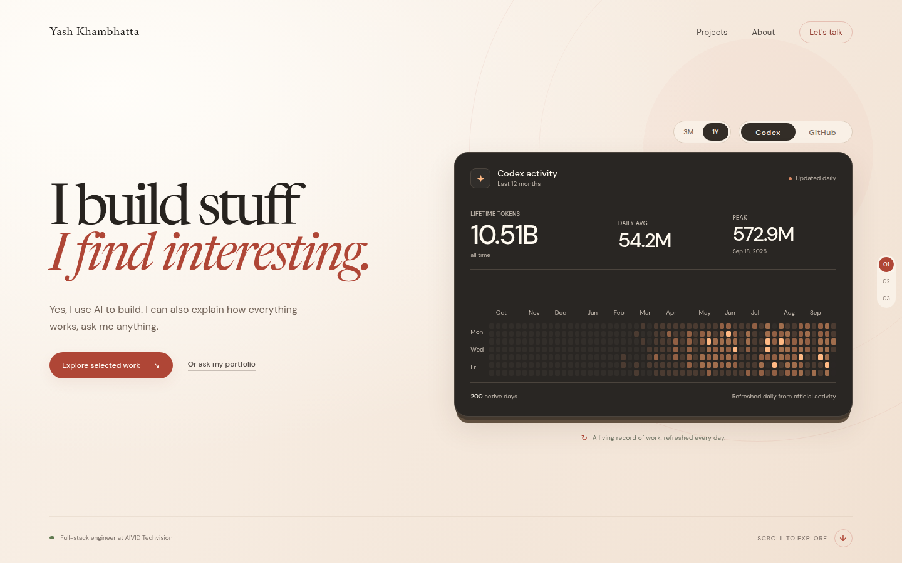
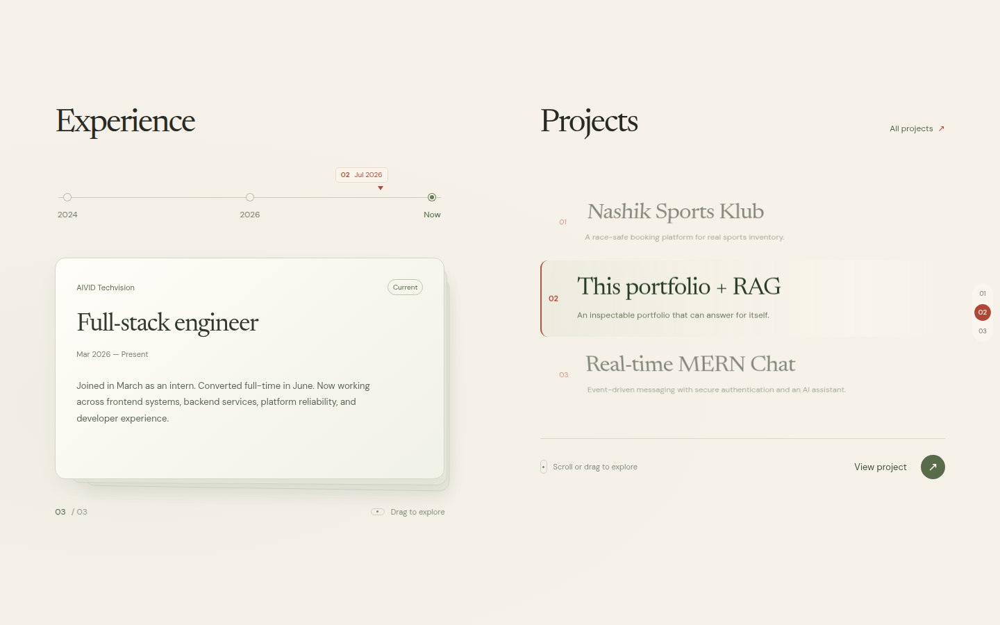
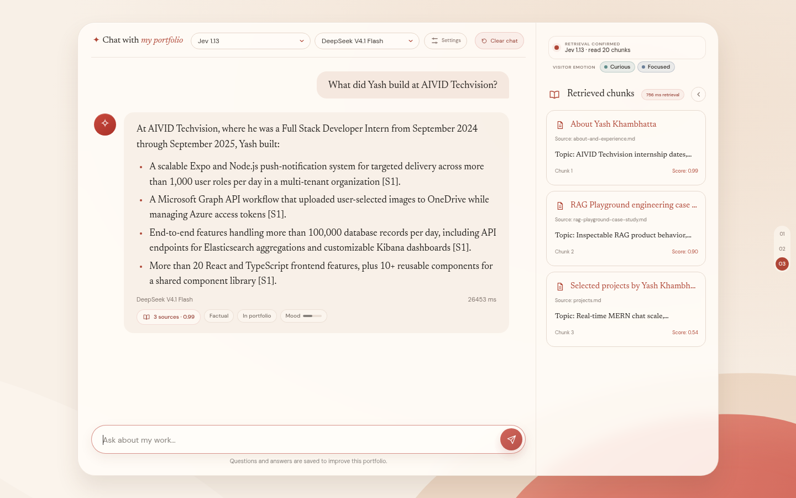
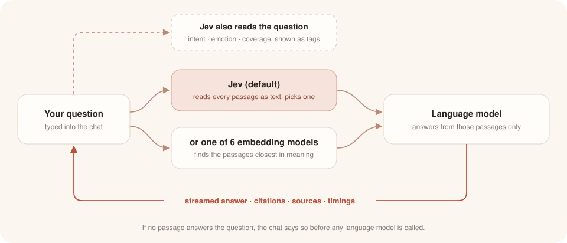

<div align="center">

<a href="https://www.yash456k.com"></a>

<h1>Ask my portfolio</h1>

<p>My portfolio site, with a chat that answers questions about my work and shows the sources behind every answer.</p>

[](Dockerfile)
[](frontend/)
[](app/)
[](sql/schema.sql)

</div>

<br>

The site at [yash456k.com](https://www.yash456k.com) holds my experience, my projects, and a chat you can ask about any of it. The home page pairs a short introduction with a graph of my daily coding activity, refreshed every night from Codex and GitHub, where you can switch between the last three months and the full year.

## Experience and projects

Scrolling down, experience and projects sit side by side. The role cards stack like a deck you can drag through, the timeline above them marks where each role and the selected project fall, and the project wheel turns through my projects and opens each one with its details, metrics, and links. On a phone the same sections work with swipes.

[](https://www.yash456k.com/#work)

## The chat

The chat answers from a small set of documents about me, split into hand-reviewed passages. Every answer streams in with citations, and the panel beside it shows which passages were used, how closely each one matched, which model wrote the answer, and how long each step took.

[](https://www.yash456k.com/#playground)

## How it works

A question first goes to a retriever, which picks the passages most likely to hold the answer, and a language model then writes the reply from those passages alone, citing each one it uses.



You can choose the retriever: one of six embedding models, two of them fine-tuned on reviewed questions about my work, or Jev, a decision model from TypeSafe that reads every passage as plain text and picks the one that answers the question. Jev is the default because it put the right passage first more often than any of the embedding models, and when nothing in the portfolio can answer a question it says so before a language model is ever called.

| Retrieval | Recall@1 | Mean reciprocal rank |
|---|---:|---:|
| **Jev** (default) | **0.95** | **1.00** |
| Portfolio E5 Small, fine-tuned | 0.81 | 0.91 |
| BGE Base | 0.78 | 0.90 |
| MiniLM L6 | 0.64 | 0.79 |

These come from 39 answerable test questions, and the [full comparison](evaluation/jev-retrieval.md) covers all seven routes and how refusals were checked. Hand-reviewed passage boundaries raised Recall@5 by 0.10 over automatic splitting ([report](docs/manual-semantic-chunking-evaluation.md)). DeepSeek V4.1 Flash writes the answers, mostly because it was cheap lol, and it also stuck to the facts better than the other seven models I tried ([report](evaluation/llm-comparison.md)). Jev also reads what each visitor is asking for and how they seem to feel, which shows up as small tags in the chat.

## Run it yourself

With Node.js 22 you can run the site against the live API, which needs no models or keys (the public rate limits still apply):

```bash
git clone https://github.com/Yash456k/ask-my-portfolio.git
cd ask-my-portfolio/frontend
npm ci
VITE_API_URL=/api npm run dev
```

Running your own backend needs Docker and a `.env` copied from `.env.example` with Groq and OpenRouter keys, plus a TypeSafe key if you want Jev. The API also expects the two fine-tuned models in `model-artifacts/`, which are not in the repository; `scripts/train_portfolio_embedders.py` rebuilds them from the reviewed data in `training/`.

```bash
docker compose build api
docker compose up -d --wait db
docker compose run --rm --no-deps api python -m app.ingest --corpus /app/corpus
docker compose up -d api
```

Tests run with `pytest -q` and `npm --prefix frontend run check`, and the evaluation suites are described in [evaluation/README.md](evaluation/README.md).

## License

[MIT](LICENSE)
